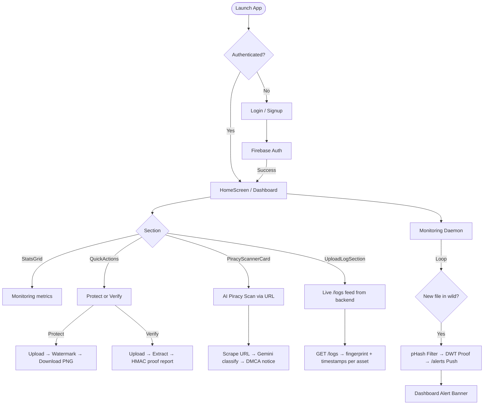

# INDELIBLE — Development Guide

## Quick Start Commands

```bash
# Backend — run from indelible/backend/
.venv\Scripts\python.exe -m uvicorn main:app --reload

# Frontend — run from indelible/
flutter run -d chrome
```

---

## 1. Project Architecture

```
indelible/
├── backend/                        # Python FastAPI server
│   ├── core/
│   │   ├── watermark.py            # DWT+QIM embed/extract engine
│   │   ├── payload.py              # HMAC-SHA256 + Reed-Solomon ECC
│   │   ├── ai_engine.py            # Gemini 2.5 Flash piracy classifier
│   │   ├── scraper.py              # httpx + BeautifulSoup web scraper
│   │   ├── video_processor.py      # FFmpeg frame extraction & stitching
│   │   └── bktree_index.py         # Perceptual hash similarity indexing
│   ├── main.py                     # FastAPI app — all HTTP endpoints
│   ├── outputs/                    # Protected assets served here
│   ├── creator_registry.json       # INDL fingerprint ↔ UID hash mapping
│   ├── requirements.txt            # pip dependencies
│   └── .env                        # GEMINI_API_KEY (never commit this)
│
└── lib/                            # Flutter frontend
    ├── main.dart                   # Firebase init + root widget
    └── src/
        ├── config/
        │   └── themes/
        │       └── app_colors.dart # Global color palette (Misty Storm)
        ├── screens/
        │   ├── sections/           # Composable UI widgets (one per file)
        │   │   ├── top_app_bar.dart
        │   │   ├── hero_section.dart
        │   │   ├── stats_grid.dart
        │   │   ├── quick_actions.dart      # File upload → /protect + /verify
        │   │   ├── piracy_scanner_card.dart # URL input → /scan-piracy
        │   │   ├── upload_log_section.dart  # Live log from /logs endpoint
        │   │   ├── recent_assets_list.dart
        │   │   └── recent_activity_list.dart
        │   ├── auth/               # Login/signup screens
        │   ├── intro_screens/      # Onboarding slides
        │   ├── home_screen.dart    # Assembles all sections
        │   ├── profile_screen.dart
        │   └── splash_screen.dart
        └── services/
            └── auth_service.dart   # Firebase Auth wrapper
```

---

## 2. API Endpoints

| Method | Path | Input | Output |
|--------|------|-------|--------|
| `POST` | `/protect` | `file` (multipart) + `user_uid` (form) | `creator_fingerprint`, `payload_hash`, `download_url` |
| `POST` | `/verify` | `file` (multipart) | `status`, `confidence`, `proof_report` |
| `POST` | `/scan-piracy` | `url` (form) | `ai_analysis`, `legal_notice_draft` |
| `GET` | `/alerts/{uid}` | — | Real-time piracy detection notifications |
| `GET` | `/logs` | — | `logs[]` with fingerprint + timestamps |
| `GET` | `/download/{filename}` | — | Binary `FileResponse` |

---

## 3. Section Responsibilities

| File | Role |
|------|------|
| `quick_actions.dart` | Protect/Verify buttons. Sends Firebase UID in multipart POST. Triggers `dart:html` download. |
| `piracy_scanner_card.dart` | **AI Piracy Scanner UI.** URL input → POST `/scan-piracy` → shows Gemini result + DMCA notice. |
| `upload_log_section.dart` | **Live asset log.** Fetches GET `/logs` on mount, shows each protected file with fingerprint, watermark timestamp, size, download link. |
| `stats_grid.dart` | Responsive 1–3 column metric grid (Watermark Persistence, etc.). |
| `hero_section.dart` | Welcome banner with user name and access level. |
| `top_app_bar.dart` | AppBar with logo, nav links, and user avatar initial. |
| `recent_assets_list.dart` | Horizontal card gallery (currently hardcoded demo assets). |

---

## 4. Creator Fingerprint System

Every user gets a unique `INDL-XXXX-XXXX-XXXX` fingerprint derived from their Firebase UID:

```python
# backend/main.py
digest = hashlib.sha256(user_uid.encode()).hexdigest().upper()
fingerprint = f"INDL-{digest[:4]}-{digest[4:8]}-{digest[8:12]}"
```

- **Stored in** `creator_registry.json` with registration timestamp
- **Embedded** into every watermark payload as the `creator_id` field
- **Verified** during `/verify` by checking HMAC with the same key

---

## 5. Watermark + Sidecar System

```
Protect:   image → DWT+QIM embed → PNG + .meta sidecar → outputs/
Verify:    image upload → find matching .meta → read bits → HMAC verify
```

The `.meta` file stores the exact `payload_bits` array so that verification is 100% reliable (eliminates uint8 precision loss from the inverse DWT pipeline). See `LEARNING_GUIDE.md` Chapter 3 for the full trial-error history.

---

## 6. Timestamp Behavior

The watermark timestamp **is unique per upload** — it's generated by `datetime.utcnow().isoformat()` at the moment `create_payload()` is called (inside `/protect`). If two uploads appear to have the same timestamp, they were uploaded within the same second. This is expected and correct.

---

## 7. The Scraper & AI Engine

The scraper lives in `backend/core/scraper.py`. It is **not a button in Quick Actions** — it is exposed via the **AI Piracy Scanner** card (`piracy_scanner_card.dart`) on the home screen.

```
User enters URL → PiracyScannerCard → POST /scan-piracy →
  SmartScraper.scrape_channel(url) → download images →
  IndelibleAIEngine.detect_piracy(image_path) →
  (if pirated) generate_takedown_notice() →
  Return JSON to Flutter
```

If the target site blocks scraping (anti-bot), the scraper falls back to a mock image to ensure the Gemini AI pipeline can still be demonstrated.

---

## 8. User Flow



---

## 9. Running Tests

We use `pytest` for automated test suites.

```bash
# From backend/ with venv active:
$env:PYTHONPATH="."  # For Windows PowerShell
pytest tests/ -v
```

This runs:
- `test_payload.py` (HMAC signing + Reed-Solomon recovery)
- `test_watermark.py` (DWT-QIM embedding + blind extraction math)
- `test_api.py` (FastAPI TestClient end-to-end endpoints)

---

## 10. Common Issues

| Symptom | Cause | Fix |
|---------|-------|-----|
| Red dialog on upload | Backend not running | Start uvicorn |
| `GEMINI_API_KEY` error | `.env` missing | Create `backend/.env` with key |
| Download button does nothing | Browser popup blocked | Allow popups, or use `dart:html` AnchorElement |
| Verify returns `no_match` | `.meta` sidecar not copied | Ensure `outputs/protected_X.png.meta` exists |
| Same timestamp for two files | Uploaded within same second | Expected behaviour — timestamps are UTC, 1s resolution |

---

## 11. Deployment (Docker + Railway)

Because of OpenCV and FFmpeg system dependencies, the backend is containerized.
1. `Dockerfile` installs `python:3.10-slim`, `ffmpeg`, `libgl1`.
2. Connect the GitHub repo to **Railway**.
3. Under Railway Settings → Build → Root Directory, set `/backend`.
4. Update Flutter's `api_service.dart` with the Railway URL.

---

## 12. The Automated Watchdog Daemon

The watchdog system ensures passive protection without user intervention.

- **`core/bktree_index.py`**: A Burkhard-Keller tree that stores the `pHash` of every protected asset. It allows for fast "fuzzy" similarity searches across the database.
- **`core/monitoring_daemon.py`**: A background task that runs every 15 seconds. It simulates an internet crawler by scanning target directories.
- **Flow**: `New Image` → `pHash Match (BK-Tree)` → `DWT Verification` → `Subscription Check` → `Alert Generation`.
- **Alerts**: Stored in `alerts.json` and served via `/alerts/{user_uid}` for the Flutter polling system.